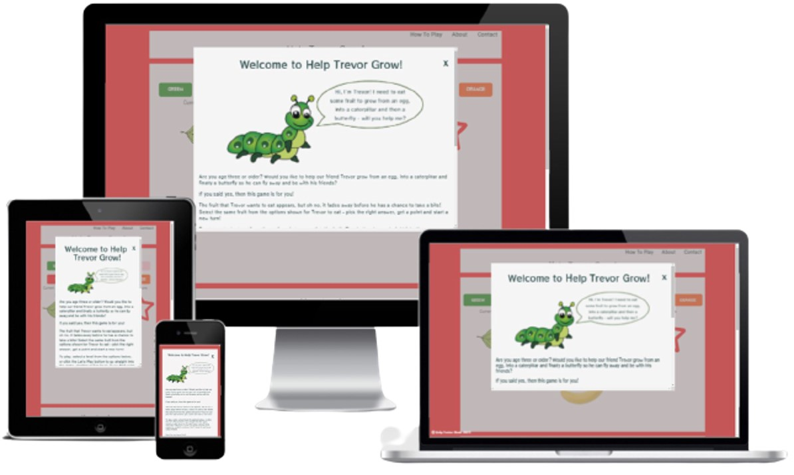
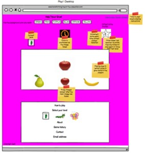

# Help Trevor Grow!

    

[View the live site here](https://catherinetrevor.github.io/help-trevor-grow/)

# Contents

* [Project Overview](#project-overview)
* [User Experience Design](#user-experience-design)
   * [Strategy](#strategy)
   * [Scope](#scope)
   * [Structure](#structure)
   * [Skeleton](#skeleton)
   * [Surface](#surface)
* [Technologies Used](#technologies-used)
* [Testing](#testing)
* [Deployment](#deployment)
* [Credits](#credits)

<small><i><a href='http://ecotrust-canada.github.io/markdown-toc/'>Table of contents generated with markdown-toc</a></i></small>

# Project Overview

This site has been built as part of the Milestone Two project with the Code Institute. The project augments the lessons from module 1 regarding HTML5 and CSS, and introduces JavaScript and jQuery.
Help Trevor Grow is a free-to-play, simple memory game designed for children approx. age 3 - 5 years old. One item of fruit is displayed in the middle of the playing area (Image A), with three images underneath 
(Images A, B and C), one of which is always the same as Image A ([see wireframe below](#play_detail)). Image A fades out after 5 seconds, and the three images appear at the bottom. 
The player then selects the same item from the three images below to gain a point and move to a new image. There are three levels, each slightly more difficult than the last level.

# User Experience Design

## Strategy

The game is designed primarily for use on a desktop, with limited help needed from an adult where a player is able to follow the instructions, or use a mouse without assistance. 
For players that cannot use a mouse, the game is best played on a touch screen device (tablet, mobile phone for example). Receiving guidance from a qualified Early Years Manager to ensure the game is age 
appropriate, there must be nothing unecessary on the screen to distract the player, allowing them to focus on the game.

The levels available increase in difficulty:

**Egg**

    

This is the simplest level. Image A is of one piece of fruit, which fades out after 5 seconds and the player then has unlimited time to click the corresponding image from the options below. 
The three image options below are visually very different from each other, to make the game age appropriate. The intended age for this level is 3.

**Caterpillar**

    

Image A contains 3 items of the same piece of fruit, but the options below still differ enough to make it challenging, but also possible. The target age for this level is 4.

**Butterfly**

    

Designed as the hardest option, this will show a higher quantity of fruit Image A, and then differing quantities of different fruit below. This means the player must not only note the type of fruit, 
but also count it, making it slightly more difficult. The target age for this level is 5.

Although there are three levels of difficulty, each level is loosely based on age range, but it is not intended as a test to see what "level" the child is at. The game is for fun can be played as many times as required.

Once the player reaches 10 points for a level, they are taken to the next level up. Having completed the last level, the game starts again.

### Target Audience

The target audience is both parents / adults with young children, as they will connect to the game and if needed, help the child to play. The players are intended to be children from approx. age 3 to 5. 
The game must be colorful and appealing to the player, whilst to a degree, educational and easy to play.

## User Stories

**Adult first-time site visitors**

a. As an adult first-time visitor, I want to easily navigate the site and quickly start a game.

b. As an adult first-time visitor, I want to understand how to play the game, so I can explain it to my child if necessary.

c. As an adult first-time visitor, I want to feel confident that the game is free-to-play and age appropriate.

d. As an adult first-time visitor, I want to understand what my child can gain from the game.

e. As an adult first-time visitor, I want to know how to make the game more personal such as changing the level or some aspect of the site.

**Child first-time visitor goals:**

a. As a child first-time visitor, I want to quickly understand the rules of the game.

b. As a child first-time visitor, I want to have fun playing an online game.

c. As a child first-time visitor, I want to have some independence in play and feel the game is personally for me, by making my own choices.

d. As a child first-time visitor, I want to feel good when I select the correct option.

e. As a child first-time visitor, I want to understand that I got an answer wrong, but feel motivated to try again.

f. As a child first-time visitor, I want to feel encouraged to try the next level.

## Scope

**Existing Features**

Based on the User Stories from the target audience, the game contains the following features:

 Feature  | Details  |
|---|---|
| Introduction pop-up modal | Basic information about the game and how to play. This is a pop-up modal which displays automatically on site opening, so there is only one file / page. This can always be opened via a link at the top of the playing page.  |
| Footer | Game name, contact email address.  |
| Images | Fun, colorful, age appropriate. The images of the fruit will be very simple, with nothing else included (i.e. not in a basket or on a tree).  |
| About | Background information about why the game exists and it's purpose for education and fun. This will be displayed in the pop-up modal. |
| Play | Large colorful buttons, to start and play the game, so it is clear to the player what they should do.  |
| Color options | Color options to change the background so the player can personalise the game and have an appropriate level of control. |
| Correct / Incorrect answer pop-up modal | Clear information, whether the player selected the correct or incorrect answer. |
| Correct answer marker | Clear information that the player has answered the questions correctly which increments the score after every correct answer. There will not be a counter for incorrect answers. |

**Future features**

**Feature 1:** Animation. In the future I would like to show the Egg changing into a Caterpillar, then growing wings into a Butterfly and flying as the player moves through each level, to give more life to the game. 
At present I do not have the knowledge to create this feature.

**Feature 2:** More levels. The game is very basic, but if I had more time would like to build on the levels and include more options in each level, then more levels, up to age 7.

## Structure

The game has a very basic structure. How to play information is provided in the pop-up modal, which appears automatically when the site is opened, but can then also be accessed from the playing page.

JavaScript is used to change the playing levels, so there is only one html file.

## Skeleton

**Wireframes**

**Welcome pop-up modal | Desktop**

**Welcome pop-up modal | Tablet**

**Welcome pop-up modal | Mobile**

**Play | Desktop**

**Play | Tablet**

**Play | Mobile**

**Play area detail** 

The game will not show the answer image at the same time as the three images below; the above wireframes are to show the position of the images when they appear.

The game will have one file only, with the pop-up modal displaying over it. The images will be changed depending on the level selected using JavaScript.

**Workflow**

## Surface

### Typography

The site uses Rocknroll from Google fonts, with sans-serif as a back up. It has been chosen as it looked "fun" and engaging to meet the requirements of the child target audience, but also easy to read for those 
just starting to learn.

[Google Fonts - Rocknroll](https://fonts.google.com/specimen/RocknRoll+One?preview.text_type=custom&preview.text=Help%20feed%20Trevor%20the%20Caterpillar!&selection.family=RocknRoll+One)

### Imagery

[See separate Imagery file.](IMAGERY.md)

### Color Scheme

The site uses the following standard HTML colors:

**Header and footer text:** white

**Main play area and pop-up modal text:** darkslategray

**Main background color:** whitesmoke (#F5F5F5)

**Background colors:** red; green; purple; pink; orangered; blue

### Favicon

As the site only has one page, there is no favicon.

## Technologies Used

This project uses the following languages:

HTML 5
CSS
JavaScript
jQuery

This project was created on [GitHub](http://www.github.com/).

This project uses the following libraries and frameworks:

* [Balsamiq](http://www.balsamiq.com/) - used to create all wireframes
* [Bootstrap](http://bootstrap.com/) - Bootstrap was used for part of grid structure and was heavily modified to meet the needs of the project
* [Google Fonts](https://fonts.google.com/specimen/RocknRoll+One?preview.text_type=custom&preview.text=Help%20feed%20Trevor%20the%20Caterpillar!&selection.family=RocknRoll+One) - RocknRoll
* [Font Awesome](http://www.fontawsome.com/) - [star](https://fontawesome.com/icons/star?style=regular) for the correct answer counter, [copyright](https://fontawesome.com/icons/copyright?style=regular)
* [BEM](http://getbem.com/introduction/) - used as the format for CSS
* [Sweet Alert](https://sweetalert.js.org/) - used in replacement of the pop-up modal for correct and incorrect answers
* [Tiny PNG](https://tinypng.com) - used to resize images to reduce site loading time
* [Monday.com](https://view.monday.com/1055700560-c01e5354c02ab53b9f7b9e492d44d50f?r=use1) - used for project/task management
* [Am I responsive](http://ami.responsivedesign.is/) - supplied the responsive image for the top of README.md
* [Grammarly] (Example) - the free service to double check grammar and spelling

Free Formatter HTML - for HTML code formatting
Free Formatter CSS - to beautify CSS code

## Testing

See separate Testing file for information on testing and issues.

## Deployment

This project was developed using Gitpod, committed to git and pushed to Github using the built-in functionality.

**How to deploy to Github Pages**

* Log onto [Github](https://github.com).
* From the list of repositories, select CatherineTrevor/help-trevor-grow.
* From the menu bar, select Settings.

* Stay on this page and scroll down to Source.

* Select Master branch from the dropdown titled none, and click save.

* Wait a few minutes to retrive the live link.

**How to fork the GutHub Repository**

Forking the repository allows you to make a copy of the original in your GitHub account, and make changes without affecting the original.

* Log onto [Github](https://www.github.com).
* From the list of repositories, select CatherineTrevor/gothenburg-netball.
* At the top of the repository, select the "Fork" button.
* This should create a copy within your account.

**How to run this project locally**

* Log onto [Github](https://www.github.com): create an account if required.
* From the list of repositories, select CatherineTrevor/gothenburg-netball.
* Click the "Code" dropdown within the menu above the commits.
* Copy the URL address, or Download ZIP and save locally.
* Open your chosen IDE and navigate to the location you want the cloned directory to be saved.
* Type git clone and copy the URL within the CLI and press enter.

Alternatively, select "Open with Github Desktop".

## Credits

* Tutors at Code Institute: help with how to store used images in an array to ensure they didn't duplicate.
* YouTube tutorials on JavaScript;
        * [Web Dev Simplified](https://www.youtube.com/watch?v=Ki0XXrlKlHY)
        * [Adam Khoury](https://www.youtube.com/watch?v=4uL9bAKOaVQ)  
* [W3 Schools](https://www.w3schools.com) - [modal pop-ups](https://www.w3schools.com/howto/tryit.asp?filename=tryhow_css_modal); [fade To]( https://www.w3schools.com/jquery/jquery_fade.asp), 
[hover](https://www.w3schools.com/howto/howto_css_zoom_hover.asp)
* [Stackoverflow](https://www.stackoverflow.com/) - [countdown timer](https://stackoverflow.com/questions/31106189/create-a-simple-10-second-countdown); 
[target elements](https://stackoverflow.com/questions/22767609/add-event-listener-to-dom-elements-based-on-class); 
[find a clicked button value](https://stackoverflow.com/questions/30499447/determine-which-button-was-clicked-inside-a-div)
* [MDN](https://developer.mozilla.org/en-US/docs/Web/JavaScript) - general JavaScript information
* [CSS Tricks](https://css-tricks.com/working-with-javascript-media-queries/) - help using JavaScript to remove a class for a media query
* [Coding Sight](https://codingsight.com/git-branching-naming-convention-best-practices/) - help in understanding standard convention for branch naming in Github
* [The Coding Train](https://www.youtube.com/watch?v=oPpnCh7InLY) - YouTube video to help understand branching in Github
* [removebg](https://www.remove.bg/t/change-background) - remove the background of the images and replace with whitesmoke to match site background color
* Narender Singh, my mentor at Code Institute for his feedback and support.

The idea for the game and all content is my own.

