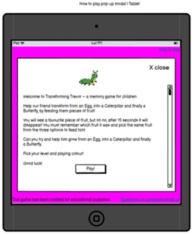
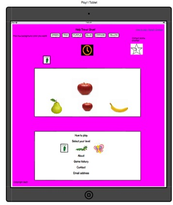
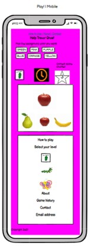
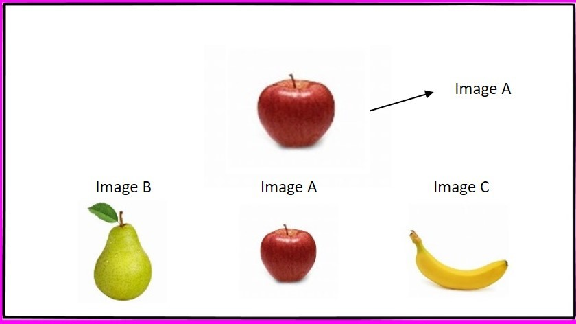

## Skeleton

**Wireframes**

**Welcome pop-up modal | Desktop**

**Welcome pop-up modal | Tablet**

**Welcome pop-up modal | Mobile**

**Play | Desktop**

**Play | Tablet**

**Play | Mobile**

**Play area detail** 

The game will not show the answer image at the same time as the three images below; the above wireframes are to show the position of the images when they appear.

The game will have one file only, with the pop-up modal displaying over it. The images will be changed depending on the level selected using JavaScript.

**Workflow**

