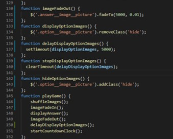

Having created the website for mainly desktop, each workflow was tested following development, using [Monday.com](https://view.monday.com/1055700560-c01e5354c02ab53b9f7b9e492d44d50f?r=use1) to 
provide structure to the testing, during development and then after set live using Gitpages. 

Testing conducted outside of the development tool on the following;

iPhone SE2020
iPhone 12
iPad Pro 9.7"
All on iOS 14.3.

Testing conducted on the following browsers;

Safari
Chrome
Microsoft Edge
Firefox
Family and friends were also invited to test it and provide feedback, one of whom is a qualified Early Years Manager, specialising in development of pre-school aged children.

**User story testing**

The following gives examples of where the deployed site meets the needs of the users / players.

| User story | Requirement met
|---|---|
| a. As an adult first-time visitor, I want to easily navigate the site and quickly start a game. | |
| b. As an adult first-time visitor, I want to understand how to play the game, so I can explain it to my child if necessary. |  |
| c. As an adult first-time visitor, I want to feel confident that the game is free-to-play and age appropriate. |  |
| d. As an adult first-time visitor, I want to understand what my child can gain from the game. |  |
| e. As an adult first-time visitor, I want to know how to make the game more personal such as changing the level or some aspect of the site. |  |

| User story | Requirement met
|---|---|
| a. As a child first-time visitor, I want to quickly understand the rules of the game. |  |
| b. As a child first-time visitor, I want to have fun playing an online game. | Feedback from numerous testers: their children enjoyed playing the game, gaining a new point and moving to the next level. They also enjoyed changing the colors in the game, which many did whilst playing. |
| c. As a child first-time visitor, I want to have some independence in play and feel the game is personally for me, by making my own choices. | |
| d. As a child first-time visitor, I want to feel good when I select the correct option. | |
| e. As a child first-time visitor, I want to understand that I got an answer wrong, but feel motivated to try again. | |
| f. As a child first-time visitor, I want to feel encouraged to try the next level. | |

**Branches**

Branches were used during deployment, when testing a new page layout and function workflow.

**Lighthouse report**

**Game workflow testing**

Testing the workflow has been done throughout development, including by testers not directly involved in the project.

## Issues

[#1: Countdown timer continues](https://github.com/CatherineTrevor/help-trevor-grow/issues/1)

This image was finally solved when the countdown timer was changed to a clock with a rotating hand to provide better user experience for the player, and the option images appear after the answer image A has completely faded.

[#2: Fade out function continues after correct answer selected](https://github.com/CatherineTrevor/help-trevor-grow/issues/2)

[Research source](https://stackoverflow.com/questions/10517835/can-javascript-function-execution-be-interrupted)

Should the player change levels quicker than the question has finished, the imageFadeOut functions still executes, meaning the player can see the end of the previous level, before changing to a new one.

Based on much research and attempting setTimeout and numerous functions, it has been concluded that it is not possible to stop a function mid-way through it's execution. Therefore, should a player try to change levels whilst
playing a turn, two pop-ups appear asking Ready, then Let's play, lasting 2.5 seconds each. This gives the current turn enough time to finish before the player starts the new turn.

[#3: Images don't appear on published site](https://github.com/CatherineTrevor/help-trevor-grow/issues/3)

**Code validator**

**HTML**

**CSS**

**JavaScript**

